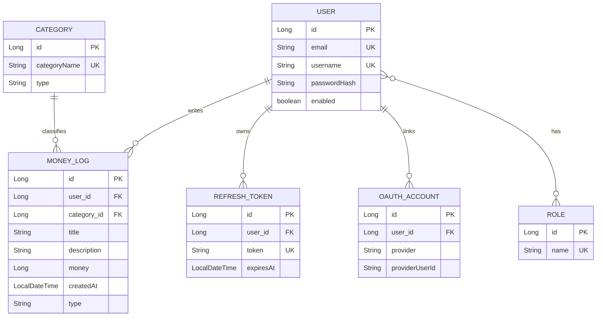

# 💰 머니로그 (MoneyLog)

> 수입·지출을 기록하고 카테고리별·월별 통계를 확인하는 개인 가계부 웹 서비스


## 🔗 바로가기

- 웹 애플리케이션: http://localhost:3000
- Swagger UI: http://localhost:8080/swagger-ui-custom.html
- [요구사항 정의서](docs/요구사항정의서.md)
- [ERD 및 API 설계](docs/ERD-API설계.md)

## 📌 프로젝트 소개

MoneyLog는 이메일 또는 Google 계정으로 로그인해 자신의 거래내역을 관리하는
Spring Boot·Next.js 기반 웹 애플리케이션입니다. 월별 수입·지출·잔액,
카테고리별 지출과 최근 여러 달의 추이를 대시보드에서 확인할 수 있습니다.

## ✨ 주요 기능

- 🔐 이메일 회원가입·로그인 및 Google OAuth2 로그인
- 🔁 JWT Access Token과 HttpOnly 쿠키 기반 Refresh Token 재발급
- 💸 수입·지출 내역 등록·조회·수정·삭제
- 🔎 연도·월·유형·카테고리 필터와 페이징
- 📊 월별 요약, 카테고리별 지출, 월별 추이 차트
- 🗂️ 18종 기본 카테고리와 관리자 카테고리 관리
- 🛡️ 사용자별 거래내역 접근 제한
- ✅ 입력 검증과 공통 예외 응답

> 예산 필드는 엔티티에만 존재하며 예산 설정·초과 경고 기능은 아직 구현되지 않았습니다.

## 🛠️ 기술 스택

| 구분 | 기술 |
|---|---|
| Backend | Java 17, Spring Boot 4.1.0, Spring Web MVC, Spring Data JPA |
| Security | Spring Security, OAuth2 Client·Resource Server, Nimbus JWT, BCrypt |
| Frontend | Next.js 16, React 19, TypeScript, Tailwind CSS, Recharts |
| Database | MySQL 8.4, H2(테스트) |
| API 문서 | springdoc-openapi, Swagger UI |
| 실행 환경 | Docker, Docker Compose |

## 🚀 실행 방법

### 사전 요구사항

- Docker Desktop 또는 Docker Engine와 Docker Compose

### 1. 환경 변수 준비

```powershell
Copy-Item .env.example .env
```

생성한 `.env`에서 비밀번호, JWT Secret, Google OAuth 정보를 변경합니다.
`JWT_SECRET`은 32바이트 이상이어야 합니다.

### 2. 애플리케이션 실행

```powershell
docker compose up --build -d
```

MySQL, Spring Boot API, Next.js 프론트엔드가 함께 실행됩니다.

### 3. 종료

```powershell
docker compose down
```

데이터는 `mysql-data` Docker 볼륨에 유지됩니다.

## 🔑 인증 방식

- Access Token: API 응답으로 발급되며 `Authorization: Bearer <token>` 헤더로 전달
- Refresh Token: `refreshToken` HttpOnly 쿠키로 발급
- Access Token 만료 시 `/api/auth/reissue`에서 두 토큰을 회전
- 로그아웃 시 저장된 Refresh Token과 쿠키를 삭제

## 📡 주요 API

| 기능 | Method | Endpoint |
|---|---|---|
| 회원가입 | POST | `/api/auth/signup` |
| 로그인 | POST | `/api/auth/login` |
| 토큰 재발급 | POST | `/api/auth/reissue` |
| 로그아웃 | POST | `/api/auth/logout` |
| 내 프로필 조회 | GET | `/api/users/profile` |
| 거래내역 목록 | GET | `/api/money-logs` |
| 거래내역 등록 | POST | `/api/money-logs` |
| 거래내역 수정 | PATCH | `/api/money-logs/{id}` |
| 거래내역 삭제 | DELETE | `/api/money-logs/{id}` |
| 월별 통계 | GET | `/api/money-logs/monthly` |
| 카테고리 목록 | GET | `/api/category/all` |

전체 요청·응답 형식은 [ERD 및 API 설계](docs/ERD-API설계.md) 또는 Swagger UI에서 확인할 수 있습니다.

## 🗄️ ERD



## 🧪 테스트

Backend:

```powershell
.\gradlew.bat test
```

Frontend API client:

```powershell
node --test frontend\lib\api-client.test.mjs
```

## 📁 프로젝트 구조

```text
moneylog/
├── src/                 # Spring Boot 애플리케이션과 테스트
├── frontend/            # Next.js 프론트엔드
├── docs/                # 요구사항, ERD, API 설계
├── k8s/                 # Kubernetes 배포 매니페스트
├── compose.yaml
├── Dockerfile
└── build.gradle
```
