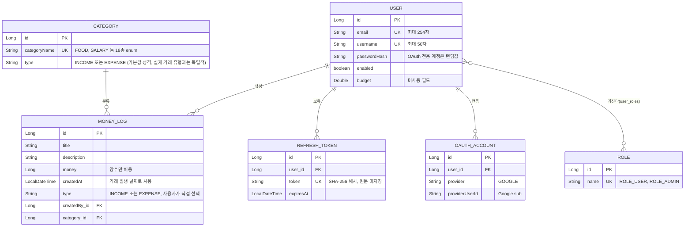

# ERD / API 설계 산출물

## 1. ERD

### 설계 메모
- `MONEY_LOG.type`은 `CATEGORY.type`에서 파생되지 않고 **사용자가 등록 시 직접 선택**한다. 같은 카테고리(예: "투자 수익")로 이익(INCOME)과 손실(EXPENSE)을 모두 기록할 수 있도록 하기 위한 설계이다.
- `CATEGORY`는 사용자별로 존재하지 않고 **전역(global)** 데이터이며, 18종의 고정된 `CategoryName` enum 값 안에서만 활성화/비활성화(추가/삭제)할 수 있다.
- `REFRESH_TOKEN`, `OAUTH_ACCOUNT`는 스키마상 `USER`와 1:N이지만, 비즈니스 로직상 사용자당 최대 1건(리프레시 토큰)/Provider당 1건(OAuth 연동)만 유지된다.
- `USER.budget`은 엔티티에는 존재하지만 현재 어떤 API에서도 사용하지 않는 필드다(추후 예산 기능에서 사용 예정, 사이드바에 "예산" 메뉴가 "준비중"으로 표시되어 있다).

## 2. API 설계

Base URL: `http://localhost:8080` (배포 시 실제 도메인으로 교체)
인증 방식: `Authorization: Bearer <accessToken>` 헤더. Refresh Token은 `refreshToken`이라는 이름의 httpOnly 쿠키(`path=/api/auth`)로 전달.

### 2.1 Auth API (`/api/auth`)

| Method | Path | 설명 | 인증 | 요청 | 응답 |
|---|---|---|---|---|---|
| POST | `/api/auth/signup` | 회원가입 | 불필요 | `{username, email, password}` | 201 `{username, email}` |
| POST | `/api/auth/login` | 로그인 | 불필요 | `{email, password}` | 200 `{accessToken}` + `Set-Cookie: refreshToken` |
| POST | `/api/auth/reissue` | 토큰 재발급 | refreshToken 쿠키 | 없음 | 200 `{accessToken}` + 새 `refreshToken` 쿠키 |
| POST | `/api/auth/logout` | 로그아웃 | refreshToken 쿠키(선택) | 없음 | 204 |
| GET | `/oauth2/authorization/google` | Google 로그인 시작 | 불필요 | 없음 | 302 → Google 동의 화면 |
| GET | `/login/oauth2/code/google` | Google 콜백 (Spring Security 내부 처리) | 불필요 | 없음 | 302 → `FRONTEND_URL/login#accessToken=...` |

### 2.2 User API (`/api/users`)

| Method | Path | 설명 | 인증 | 요청 | 응답 |
|---|---|---|---|---|---|
| GET | `/api/users/profile` | 내 프로필 조회 | Bearer | 없음 | 200 `{username, email}` |
| PATCH | `/api/users/profile` | 닉네임 수정 | Bearer | `{username}` | 200 `{username, email}` |
| DELETE | `/api/users/profile` | 회원 탈퇴 | Bearer | 없음 | 204 |

### 2.3 Category API (`/api/category`)

| Method | Path | 설명 | 인증 | 요청 | 응답 |
|---|---|---|---|---|---|
| GET | `/api/category/all` | 활성 카테고리 전체 조회 | 불필요 | 없음 | 200 `[{id, categoryName, categoryType}]` |
| POST | `/api/category` | 카테고리 추가 | Bearer + ROLE_ADMIN | `{categoryName, categoryType}` | 200 `{id, categoryName, categoryType}` |
| PATCH | `/api/category/{id}` | 카테고리 수정 | Bearer + ROLE_ADMIN | `{categoryName, categoryType}` | 200 `{id, categoryName, categoryType}` |
| DELETE | `/api/category/{id}` | 카테고리 삭제 | Bearer + ROLE_ADMIN | 없음 | 204 |

`categoryName`/`categoryType`은 자유 문자열이 아니라 고정된 `CategoryName`(18종 한글 표시명)/`CategoryType`(INCOME, EXPENSE) 값 중 하나여야 한다.

### 2.4 MoneyLog API (`/api/money-logs`)

| Method | Path | 설명 | 인증 | 요청 | 응답 |
|---|---|---|---|---|---|
| GET | `/api/money-logs` | 거래내역 목록 (필터+페이징) | Bearer | query: `year, month, type, categoryId, page, size` (전부 선택) | 200 `Page<{id, username, title, description, money, date, category, type}>` |
| POST | `/api/money-logs` | 거래 등록 | Bearer | `{title, description, money, date, category, type}` | 201 위와 동일 형태 |
| GET | `/api/money-logs/{id}` | 거래 단건 조회 | Bearer (본인 소유만) | 없음 | 200 |
| PATCH | `/api/money-logs/{id}` | 거래 수정 | Bearer (본인 소유만) | `{title, description, money, date, category, type}` | 200 |
| DELETE | `/api/money-logs/{id}` | 거래 삭제 | Bearer (본인 소유만) | 없음 | 204 |
| GET | `/api/money-logs/monthly` | 월별 통계 | Bearer | query: `year, month` (필수) | 200 `{totalIncome, totalExpense, balance, categoryExpenses: [{categoryId, categoryName, amount}]}` |

`category`는 `CategoryName` enum의 raw name(예: `FOOD`, `SALARY`)이며, `CategoryResponse.categoryName`(한글 표시명)과는 표현이 다르다 — 프론트엔드는 별도 매핑 테이블(`CATEGORY_META`)로 변환한다. `date`는 `yyyy-MM-dd` 형식 문자열로 요청하고, 응답에서는 `LocalDateTime.toString()` 형식으로 내려온다.

### 2.5 공통 에러 응답

| 상황 | 상태코드 | 응답 예시 |
|---|---|---|
| 입력 검증 실패 | 400 | `{"필드명": "에러 메시지", ...}` |
| 잘못된 카테고리/유형 값 | 400 | `{"message": "..."}` |
| 인증 실패(비밀번호 오류, 무효 토큰) | 401 | `{"message": "..."}` |
| 권한 없음(관리자 기능을 일반 사용자가 호출) | 403 | `{"message": "You are not allowed"}` |
| 대상 없음(존재하지 않는 id, 본인 소유 아님) | 404 | `{"message": "..."}` |

### 2.6 Swagger UI

`springdoc-openapi`로 자동 생성되며 로컬 기준 `http://localhost:8080/swagger-ui-custom.html`에서 확인 가능하다.
